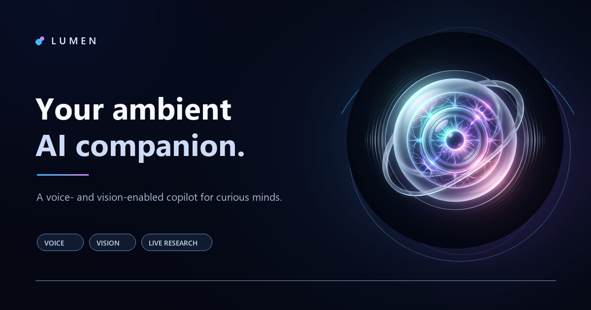

<p align="center">
  
</p>

<h1 align="center">Lumen AI</h1>

<p align="center">
  <strong>Voice, vision, and curiosity—together in one AI copilot.</strong><br />
  Talk through ideas, understand your files, explore the web, or share a browser tab when you choose.
</p>

<p align="center">
  <a href="#features">Explore features</a> ·
  <a href="#run-locally">Run it locally</a> ·
  <a href="#browser-tab-sharing-extension-mvp">Share a tab</a> ·
  <a href="#configuration">Configure providers</a>
</p>

<p align="center">
  
  
  
  
</p>

Lumen is a voice- and vision-enabled AI copilot built with React, Vite, and Express. Have a spoken conversation, inspect an image or PDF, research the web, or bring in a page by explicitly sharing its text.

The public landing page is at `/`. Open the existing copilot with **Talk with Lumen** or go directly to `/#app`; the hash route works on static hosts without server-side routing.

## Features

- **🎙️ Voice conversation:** speak with Lumen using browser speech recognition, with an AWS Transcribe fallback if the browser speech service is unreachable. Amazon Polly neural voices are used when configured.
- **🖼️ Image and PDF analysis:** attach a photo or PDF and ask Lumen to inspect it.
- **🔎 Web research:** request sourced research reports; Lumen searches and reads public web pages, then can create a downloadable PDF.
- **🌦️ Live information:** ask about weather or cryptocurrency prices to show interactive data cards.
- **🧠 Personalization and memory:** choose a response tone and style, upload a text/Markdown/JSON profile, import reviewed context from another AI with a copy-and-paste prompt, and manage cloud-synced memories. Automatic memory can be paused; saved items can be reviewed, edited, or deleted.
- **🔐 Sign-in:** authenticate with GitHub. The server verifies the OAuth session; repository access is not requested.
- **✨ Conversation tools:** use prompt starters, choose a voice and language, export a conversation, and adjust the visual theme. A dismissible quick-start guide points out the sphere, chat, Explore examples, and attachments on first visit.
- **📲 Installable PWA:** install Lumen on Android from a supported browser, or add it to the iPhone/iPad Home Screen from Safari. The app needs an internet connection for AI and live-data features.

AI responses and cloud-backed features require valid provider credentials. See [Configuration](#configuration).

## Requirements

- Node.js 20 or later
- npm 8 or later
- AWS credentials with access to the configured Amazon Bedrock model for the default AI provider

An OpenAI API key can optionally provide the server-side chat fallback. Amazon Polly credentials enable neural audio; without them, the browser speech-synthesis fallback may be used.

## Run locally

1. Install dependencies:

   ```sh
   npm install
   ```

2. Create a `.env` file in the project root. Start from `.env.example` and fill in the credentials you want to use.

3. Start both the Vite frontend and Express API:

   ```sh
   npm run dev:all
   ```

4. Open [http://localhost:5173](http://localhost:5173).

`npm run dev` starts only the frontend. For chat and other API features during development, the backend must also be running; `npm run dev:all` starts both processes.

## Install on mobile

Lumen is a Progressive Web App and can be installed from its secure production URL (or `localhost` during development). On Android, open Lumen in a supported browser and use the install prompt or the browser menu. On iPhone or iPad, open Lumen in Safari, tap **Share**, then choose **Add to Home Screen**. iOS does not expose the Android-style install prompt to websites.

The installed app opens in a standalone window. AI conversations and live data still require an internet connection; offline app-shell caching is not enabled.

## Configuration

The backend loads `.env` at startup. Common variables:

| Variable | Purpose |
| --- | --- |
| `PORT` | Express API port; defaults to `3000`. |
| `AWS_ACCESS_KEY_ID` / `AWS_SECRET_ACCESS_KEY` | AWS credentials for Bedrock and Polly. Use a session token too when using temporary credentials. |
| `AWS_SESSION_TOKEN` | Optional AWS session token for temporary credentials. |
| `AWS_REGION` | Bedrock region; defaults to `eu-north-1`. |
| `BEDROCK_MODEL_ID` | Optional Bedrock model override. |
| `POLLY_REGION` | Polly region; defaults to `eu-west-1`. |
| `OPENAI_API_KEY` | Optional server-side OpenAI fallback key. |
| `GITHUB_OAUTH_CLIENT_ID` | GitHub OAuth App client ID, configured on the API server. |
| `GITHUB_OAUTH_CLIENT_SECRET` | GitHub OAuth App secret. Server-side only; never use a `VITE_` prefix. |
| `GITHUB_OAUTH_CALLBACK_URL` | Callback URL registered in the GitHub OAuth App. |
| `LUMEN_APP_URL` | Frontend URL to return to after GitHub sign-in. |
| `LUMEN_SESSION_SECRET` | Random secret of at least 32 characters used to sign HttpOnly session cookies. |
| `LUMEN_MEMORY_TABLE_NAME` | DynamoDB table used for profile and memory records. |
| `LUMEN_ALLOWED_ORIGINS` | Comma-separated frontend origins allowed to call the API with session cookies. |
| `LUMEN_CROSS_SITE_COOKIES` | Set to `true` only when the frontend and API are on different sites; requires HTTPS. |

Keep credentials in the server-side `.env` file. Do not commit `.env` or put private API keys in `VITE_*` variables, which are exposed to browser builds.

### GitHub sign-in and cloud memory setup

1. Create a GitHub OAuth App. Set its client ID in `GITHUB_OAUTH_CLIENT_ID`, keep its secret in `GITHUB_OAUTH_CLIENT_SECRET`, and register the exact `GITHUB_OAUTH_CALLBACK_URL`. Set `LUMEN_APP_URL` to the browser-facing app URL. For local development, these URLs and the browser hostname must agree (for example, use `localhost` consistently rather than mixing it with `127.0.0.1`). The GitHub button checks the API's provider status and explains when server-side OAuth configuration is missing.
2. Generate a session secret, for example:

   ```sh
   node -e "console.log(require('crypto').randomBytes(32).toString('base64url'))"
   ```

   Store the output in `LUMEN_SESSION_SECRET`. The session cookie is HttpOnly and signed by the server.
3. Create the DynamoDB table with string partition key `userId` and string sort key `recordId`. For example, using the AWS CLI:

   ```sh
   aws dynamodb create-table --table-name lumen-user-memory --attribute-definitions AttributeName=userId,AttributeType=S AttributeName=recordId,AttributeType=S --key-schema AttributeName=userId,KeyType=HASH AttributeName=recordId,KeyType=RANGE --billing-mode PAY_PER_REQUEST
   ```

   Set `LUMEN_MEMORY_TABLE_NAME` to the table name and grant the server's IAM role only the required `GetItem`, `PutItem`, `Query`, `DeleteItem`, and `BatchWriteItem` permissions on that table. DynamoDB encryption at rest is enabled by default; use TLS and a least-privilege IAM role in production.
4. Set `LUMEN_ALLOWED_ORIGINS` for production deployments when the frontend and API are cross-origin. When they are on different sites, set `LUMEN_CROSS_SITE_COOKIES=true` and serve both over HTTPS.

GitHub accounts are stored under provider-qualified user IDs, and account linking is not currently supported. Lumen stores the profile and memory records in DynamoDB; conversation history remains in browser storage. Profile and memory context is sent to the configured AI provider with chat and research requests. Automatic memory is designed to retain useful, non-sensitive text-chat details; it uses an additional AI request per text chat and can be paused. Inspect, edit, or delete stored items in the account menu. Uploaded image/PDF attachments are not used for automatic memory extraction. The optional import-from-another-AI feature only shares content when the user copies the prompt to another assistant; pasted replies remain in the editable profile and are not saved until **Save profile** is selected. Avoid storing secrets or highly sensitive information in the profile or memories.

## Browser tab sharing (extension MVP)

The [extension/](extension) folder holds a Manifest V3 extension (Chrome, Edge, Brave, Firefox 128+) that lets you explicitly share the tab you are viewing with Lumen.

**Setup**
1. Run Lumen (`npm run dev:all`) and open it once.
2. Chrome/Edge: open `chrome://extensions`, enable Developer mode, choose **Load unpacked**, select `extension/`. Firefox: open `about:debugging#/runtime/this-firefox`, choose **Load Temporary Add-on**, select `extension/manifest.json`.
3. On the tab you want to share, click the extension icon, set your Lumen URL (default `http://localhost:5173`), and click **Share this tab**. Approve the one-time permission prompt for the Lumen origin.
4. A "Sharing tab" chip appears in Lumen; ask questions about the page. Click **Stop** (in Lumen or the popup) to end sharing.

**Safety model**
- Nothing is read until you click Share; it uses `activeTab`, so only that tab is accessible. Your text selection is shared if present, otherwise the page's visible text (max 20,000 characters, no form field values).
- The text is sent with each message while the chip is shown, and is treated by the server as untrusted data, not instructions.
- The MVP is read-only: it cannot click, type, or navigate. Any future action execution must show an explicit per-action approval.

### For end users (no developer mode)

- **No install:** in Lumen, tap **+** and choose **Share a tab or window (snapshot)**. Your browser's own picker asks which tab to share; Lumen captures one image frame, stops the capture immediately, and attaches it so you can ask about it. It reads pixels only and cannot click or type.
- **Extension (richer, text-based):** regular users install it from the Chrome Web Store / Edge Add-ons once it is published. To publish, zip the *contents* of `extension/` (for example `Compress-Archive -Path extension\* -DestinationPath lumen-tab-share.zip`), upload it in the Chrome Web Store Developer Dashboard and the Microsoft Partner Center (a developer account is required; Chrome charges a one-time fee), and set the production Lumen URL as the popup default in `extension/popup.js` before zipping. The store listing needs a privacy statement: page text is sent only to your Lumen server when the user clicks Share and is not stored.
**Verify:** `npm test` covers the server-side page-context fencing; `npm run build` checks the frontend.

**Limitations:** a snapshot is taken at share time (click Share again to refresh); restricted pages (`chrome://`, store pages, PDFs viewers) can't be read; Firefox may close the popup on the permission prompt (click Share again); the page text isn't persisted to saved conversations or memory.
## Production

Build the frontend, then start the Express server:

```sh
npm run build
npm start
```

The server serves the built frontend and API from the configured port (default `3000`).

## Troubleshooting

### Lumen does not reply

In development, check that both processes are running. Use `npm run dev:all`, then open [http://localhost:3000/api/health](http://localhost:3000/api/health). A healthy server returns JSON with `"status":"ok"`. If the API is unreachable, restart the backend and check its terminal output.

If the health endpoint works but chat still fails, check that the configured Bedrock model is available in the selected AWS region and that the AWS credentials have permission to invoke it. If using the OpenAI fallback, check `OPENAI_API_KEY` on the server.

### Voice input does not work

Allow microphone access and use a browser that supports the Web Speech API, such as current Chrome or Edge. You can still type messages if voice recognition is unavailable.

### Image or PDF analysis fails

Check the backend terminal for provider errors and confirm Bedrock access is configured. The health endpoint reports whether AWS credentials were detected; it does not validate that those credentials have model permissions.

## Project layout

```text
src/
  components/       React UI components, including the sphere, conversation feed, and profile/memory controls
  hooks/            Shared React hooks
  services/api.js   Frontend client for the Express API
  utils/            Translations and shared utilities
  App.jsx           Main application and interaction flow
  App.css           Application styling
server.js           Express API and AI-provider integration
services/           Auth sessions, DynamoDB memory, web search, live data, and PDF services
vite.config.js      Vite development server and API proxy
```

## License

This project is distributed under the MIT License. See [LICENSE](LICENSE).
# lumen-ai

